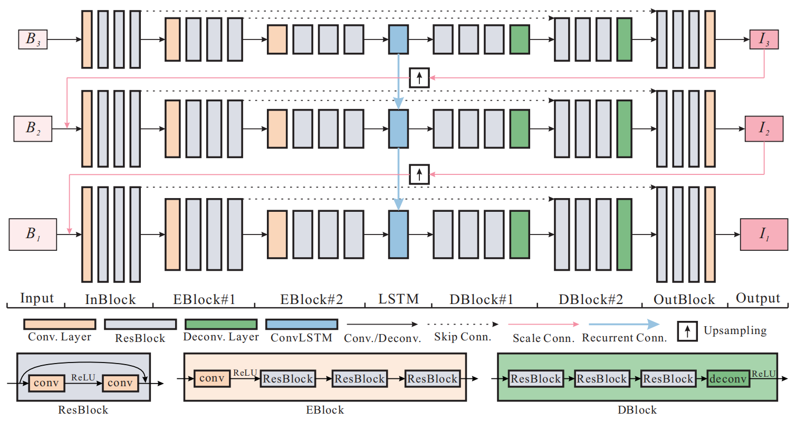

# SRN_DeblurNet_Pytorch
 SRN_DeblurNet是一个用于单幅图像去模糊的算法,该网络框架是一个由多个尺度图像输如构建的多层网络，类似于构建一个重构金字塔，逐级优化从而得到最后的重建清晰图。

 网络框架如下所示:
 

个人实现Pytorch版本的CVPR2018论文《Scale-Recurrent Network for Deep Image Deblurring》，目前实现了网络框架的搭建,数据集的读取,网络训练,测试以及模型保存等任务已经完成


## Directory ##
```
root_directory
├──chekpoints                       // 保存的模型参数
├──DataSet                          // 数据集
│   ├── train                       // 测试数据集     
│   ├── eval                        // 评估数据集                         
│   │   ├── blur                    
│   │   └── deblur                  
│   ├── data.list.py                // 用于生成数据集列表信息
│   ├── tarin.list                  // 训练数据集列表信息
│   └── eval.list                   // 评估数据集列表信息
├──model                            // 网络模型定义
│   ├── basic_block.py              
│   ├── conv_lstm.py                // conv_lstm实现(卷积的LSTM网络)
│   └── deblur                      // srn网络
├──TestData                         // 测试数据
│   ├── input                       
│   └── output                      
├──config.py                        // 模型参数
├──DataSet.py                       // 自定义数据集读取
├──train.py  
├──test.py  
├──README.md   
└──requirements.txt                        
```


## Installation ##
```bash
pip install -r requirements.txt
```

## DataSet and pre_trained model ##
DataSet中的数据集来源于[GOPRO dataset](https://github.com/SeungjunNah/DeepDeblur_release)

训练和测试的超参数，目录等设置都放在了config.py中,需要自行调整的可以去设置

checkpoints中保存了一个训练好的模型参数,这是在DataSet下使用GOPRO's模糊图像(without gamma correction)数据集训练

值得一说的是,该模型参数在训练集上PSNR已经达到了30,在测试集上PSNR达到了26(原论文达到了30)


## How to train your network ##
1. 首先你需要获得一个数据集,将数据集整理为blur和deblur两个子目录(参考DataSet/bulr_lin和DataSet/debulrred_lin),
2. 修改data_list.py中的参数,生成用于数据DataSet读取的数据文件
3. 修改config.py中的train['train_img_list']、train['val_img_list']等设置

训练模型:python train.py

## How to test your imgs ##
修改config.py:

* test['input_dir']指定输入测试图像的目录
* test['output_dir']指定输入测试图像的目录
* test['model_params']指定模型参数

然后测试模型:python test.py


## Reference ##
- [Scale-recurrent Network for Deep Image Deblurring](http://openaccess.thecvf.com/content_cvpr_2018/papers/Tao_Scale-Recurrent_Network_for_CVPR_2018_paper.pdf)
- [Deep Multi-scale CNN for Dynamic Scene Deblurring](http://openaccess.thecvf.com/content_cvpr_2017/papers/Nah_Deep_Multi-Scale_Convolutional_CVPR_2017_paper.pdf)
- github代码:https://github.com/iwtw/SRN-DeblurNet.git


